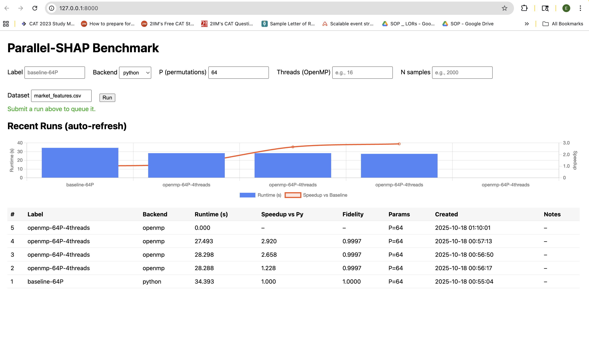

# Parallel-SHAP (OpenMP + CUDA)

This repository contains:
- A model-agnostic Monte-Carlo SHAP implementation (Python).
- An OpenMP-accelerated SHAP module (pybind11 + CMake).
- A CUDA demo kernel for SHAP with a linear head (pybind11 + CMake).
- RandomForestClassifier trained on the included dataset
- A FastAPI dashboard to run benchmarks and visualize speedups.

## Sample Dashboard Run (OpenMP)



## Quickstart

```bash
conda create -n pshap python=3.10 -y
conda activate pshap
pip install -r requirements.txt

# Train baseline model
python src/train_model.py

# Baseline SHAP timing
python src/baseline_shap.py

# Build OpenMP extension
cd src/ext_openmp && ./build.sh && cd ../..
export PYTHONPATH=src/ext_openmp/build:$PYTHONPATH

# Evaluate (Python vs OpenMP; optional CUDA)
python src/mc_shap_eval.py

# Run the dashboard
cd server
uvicorn app:app --reload
# open http://127.0.0.1:8000
```


**Note:** A pre-trained `models/model.pkl` is included.
